# Roadmap

How the tasks in this folder relate, so sessions can be started in parallel
without colliding. The task list itself is in [README.md](./README.md).

## Two kinds of dependency

**Hard dependency** — the task genuinely needs another task's outcome first.
There are currently **none** in this backlog. Every task is independently
valuable and could, in isolation, be done first.

**Soft dependency** — the tasks edit the same files, so doing them at once
produces merge pain and two agents fighting over the same code. Order does not
usually matter; _simultaneity_ does.

This distinction is the whole point of the roadmap: almost all the sequencing
below exists to avoid conflicts, not because anything is actually blocked.

## Dependency graph

```mermaid
graph LR
  subgraph Firebase["src/lib/firebase.ts"]
    T01[01 Lazy-load Firebase] -.-> T02[02 Offline persistence]
    T01 -.-> T04[04 App Check]
    T02 -.-> T04
  end

  subgraph Store["cloud.svelte.ts"]
    T01 -.-> T07[07 Split cloud store]
  end

  subgraph Notation["src/lib/tab/*"]
    T09[09 Articulation] -.-> T10[10 Rhythm]
    T10 -.-> T11[11 Repeats & tempo]
  end

  subgraph CI[".github/workflows/webapp.yml"]
    T05[05 Rules tests in CI] -.-> T06[06 Component tests]
    T05 -.-> T08[08 Pin base image]
  end

  T03[03 Offline app shell]
  T12[12 Public library]
  T13[13 Print stylesheet]

  T01 -.-> T12
```

Dotted edges are soft dependencies — "not at the same time", not "blocked by".

## File ownership

The table an agent should check before starting. Two tasks sharing a row in the
first column should not run concurrently.

| File                                                | Tasks that edit it              | Severity                                            |
| --------------------------------------------------- | ------------------------------- | --------------------------------------------------- |
| `src/lib/firebase.ts`                               | 01, 02, 04                      | **High** — all three restructure the same ~12 lines |
| `src/lib/stores/cloud.svelte.ts`                    | 01, 02, 07                      | **High** — 01 and 07 both restructure it            |
| `src/lib/tab/parser.ts`, `render.ts`, `playback.ts` | 09, 10, 11                      | **High** — same unions, same scheduler              |
| `src/routes/public/+page.svelte`                    | 01, 12                          | Low — 01 changes imports, 12 changes markup         |
| `src/routes/+layout.svelte`                         | 01, 03                          | Low — different concerns in the same file           |
| `src/routes/layout.css`                             | 09, 13                          | Low — `.hl-*` rules vs. a `@media print` block      |
| `.github/workflows/webapp.yml`                      | 05, 06, 08                      | Low — separate jobs or steps                        |
| `src/routes/shared/+page.svelte`                    | 01, 13                          | Low                                                 |
| `src/lib/components/PlayableTab.svelte`             | 11, 13                          | Low — BPM/tempo control vs. print hiding            |
| `firestore.indexes.json`                            | 12 _(only if sorting is added)_ | Needs deployment — see [AGENTS.md](../AGENTS.md)    |
| `Dockerfile`, `docker/default.conf`                 | 03, 08                          | Low — different files, related area                 |

## Parallel waves

Each wave is a set that can run **simultaneously**. Finish and merge a wave
before starting the next, or at least re-check the table above.

### Wave 1 — up to 4 in parallel

| Task                                                | Touches                       |
| --------------------------------------------------- | ----------------------------- |
| [01](./01-lazy-load-firebase.md) Lazy-load Firebase | Firebase, cloud store, layout |
| [05](./05-rules-tests-in-ci.md) Rules tests in CI   | CI workflow only              |
| [09](./09-articulation-notation.md) Articulation    | `src/lib/tab/*`               |
| [13](./13-print-stylesheet.md) Print stylesheet     | CSS, tab page                 |

These four barely intersect. Minor overlaps to be aware of: 09 and 13 both edit
`layout.css` but in disjoint regions, and 01 and 13 both touch
`shared/+page.svelte` trivially.

This is the strongest opening wave: it covers the biggest performance win, the
biggest safety gap, the headline feature, and a cheap user-visible improvement.

### Wave 2 — up to 4 in parallel, after Wave 1

| Task                                                            | Unblocked by |
| --------------------------------------------------------------- | ------------ |
| [02](./02-firestore-offline-persistence.md) Offline persistence | 01 merged    |
| [06](./06-component-interaction-tests.md) Component tests       | 05 merged    |
| [10](./10-rhythm-and-durations.md) Rhythm                       | 09 merged    |
| [12](./12-public-library-browsing.md) Public library            | 01 merged    |

No overlap between these four.

### Wave 3 — up to 5 in parallel, after Wave 2

| Task                                                    | Unblocked by                        |
| ------------------------------------------------------- | ----------------------------------- |
| [03](./03-offline-app-shell.md) Offline app shell       | 01 merged (shares `+layout.svelte`) |
| [04](./04-firebase-app-check.md) App Check              | 02 merged                           |
| [07](./07-split-cloud-store.md) Split cloud store       | 01 merged; better after 06          |
| [08](./08-pin-container-base-image.md) Pin base image   | 05 merged                           |
| [11](./11-repeats-and-tempo-markers.md) Repeats & tempo | 10 merged                           |

## Recommended priority

If tasks are run one or two at a time rather than in full waves, this is the
order that delivers the most value soonest:

1. **[01](./01-lazy-load-firebase.md)** — halves first-load JavaScript for every
   signed-out visitor. Largest measurable user-facing win in the backlog.
2. **[05](./05-rules-tests-in-ci.md)** — small, and it protects the riskiest
   surface in the repo. Rules guard all ownership and sharing, test and production
   share a project, and CI does not check them today.
3. **[09](./09-articulation-notation.md)** — the headline product gap. The parser
   was designed for it.
4. **[02](./02-firestore-offline-persistence.md) + [03](./03-offline-app-shell.md)**
   — together these make one coherent offline story. Doing only one leaves a
   half-offline app, which is arguably more confusing than none.
5. **[13](./13-print-stylesheet.md)** — cheapest real improvement here; put it
   wherever there is a spare slot.
6. **[12](./12-public-library-browsing.md)** — the only discovery surface, and
   currently the weakest page in the app.
7. **[06](./06-component-interaction-tests.md)** then
   **[07](./07-split-cloud-store.md)** — tests first so the refactor has a net.
8. **[10](./10-rhythm-and-durations.md)**, then
   **[11](./11-repeats-and-tempo-markers.md)**.
9. **[04](./04-firebase-app-check.md)**, **[08](./08-pin-container-base-image.md)**
   — valuable hardening, but no user-visible change. 04 also needs Firebase
   console access and a staged rollout, so it suits a deliberate, unhurried slot.

## Tasks needing an explicit decision

Three tasks ask for a design choice that shapes everything after it. Expect the
session to stop and decide — ideally with the repo owner — rather than guess:

- **[10](./10-rhythm-and-durations.md)** — implicit (columns become time) vs.
  explicit duration markers. Implicit would change how **every existing saved tab
  sounds**. This is the single most consequential open question in the backlog.
- **[11](./11-repeats-and-tempo-markers.md)** — whether repeats render as marks or
  expand to literal bars, which changes copy and `.txt` export output.
- **[09](./09-articulation-notation.md)** — whether share links bump to version 3.
  Related choices appear again in 10 and 11, so ideally settle the versioning
  policy once in 09.

## Tasks with deployment or external prerequisites

- **[04](./04-firebase-app-check.md)** needs Firebase console access
  (reCAPTCHA Enterprise registration) and a **staged rollout**: ship the
  token-sending client, watch the metrics, and only then enable enforcement.
  Enabling enforcement early breaks every client that has not updated.
- **[12](./12-public-library-browsing.md)** needs an index deployment _only_ if it
  adds a sort field. Keeping it to previews, badges and client-side filtering
  keeps it client-only.
- **[05](./05-rules-tests-in-ci.md)** needs Java 21+ locally to run
  `npm run test:rules` before pushing.

Anything touching Firestore rules, indexes, schemas, paths or queries must follow
the mandatory procedure in [AGENTS.md](../AGENTS.md): validate, deploy, and
_verify_ the Firebase change **before** pushing the client that depends on it.
